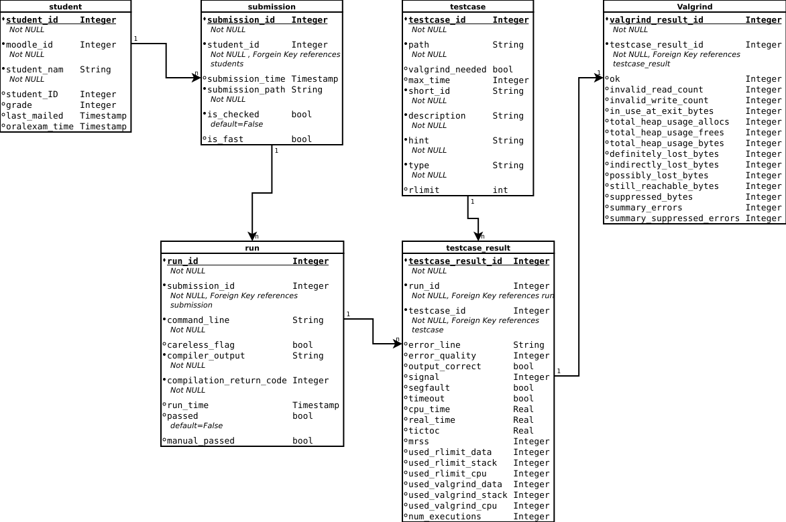

# Reworked python eval pipeline for evaluating c-programming project submissions

This python script is intended to automatically fetch submissions from a moodle page, compile these submissions for each
student and evaluate the correctness along with the performance. 
Further it is able to persist relevant information, send feedback e-mails and generate relevant grading for moodle via 
csv and also via the moodle grading api.   

## Content
1. [How to Start](#how-to-start)
    1. [Installation](#installation-and-setup)
    * [Setup](#setup)
    * [Usage](#usage)
2. [Current State of the Rework](#current-state-of-the-rework)
    1. [Stable Commandline Arguments](#stable-commandline-arguments) 
    2. [Implemented Structure](#implemented-structure) 
    3. [Implemented Features](#implemented-features)
3. [Future Development](#future-development)
    1. [Planned Structure](#planned-structure)
    2. [Planned Features](#planned-structure)
    3. [Planned Integration](#planned-integration)

## How to Start
### Installation 
Install Docker and Valgrind:

  - `sudo apt install docker.io`
  - `sudo apt install valgrind`

Ensure that python3.8 is installed if not use the following command (works on Ubuntu 18.04):

`$ sudo apt-get install python3.8 python3.8-dev python3.8-distutils python3.8-venv`

Install required packet bs4 for python3.8 by using:

  - `python3.8 -m pip install bs4`
  - `python3.8 -m pip install sqlalchemy`


### Setup


#### Docker

Build Docker File:
  - `./dockerfiles/build.sh`

#### Resources, Config Files and Templates

There needs to be a resource directory inside the `eval_pipline directory`
which contains:

  - `config_database_integrator.config`
  - `config_database_manager.config`
  - `config_submission_fetcher.config`
  - `config_test_case_executor.config`
  - `config_performance_evaluator.config`

These files are used to set relevant constants.
There are example `.config` files included in the `resource.templates` directory that need to be adjusted appropriately.

If you want to use the automatic email functionality you might want to define a `mail_templates` directory,
where you define all relevant error messages that can be part of an email to a student.
It's worth to note, that these template massages can contain placeholder tokens,
which can be replaced during runtime. These tokens should be follow the format `$placeholder_token$`. 


#### Moodel Course
Set up a Moodel Course with an excercise where students can submit a `.c` file. 
Set the maximal possible grade for this excersie to 2:
The grading for the C project is as follows:

   - 0=not passed
   - 1=submission passed
   - 2= abtestat passed

Retrieve the course ID, submission ID and ID of the account that sould be used by the pipline for logging  into moodel.
This can be done by opening the respective page in the web browser an copying the Id from the url. 
With these values update the entries in `C Programmierprojekt/eval_pipline_rework/resources` the file named `config_submission_fetcher.config`.

#### Shortcut
For convenience, put a symbolic link in `/usr/bin` so that the pipline can be called by simply running `check [args]` in the terminal:
```
sudo ln -s /path/to/eval_pipeline/__main__.py /usr/bin/check
```

### Usage
Thanks to `__init__.py` and `__main__.py`
it can be called by executing:

`/path/to/eval_pipeline/__main__.py [args]`

Relevant switches and flags are listed in Section [Commandline arguments](#stable-commandline-arguments)

For convenience it is possible to create an alias or symbolic link(see [Installation and Setup]).
It can then be called by:

`check [args]`


## Current State of the Rework
This section describes the current state of the eval pipeline. 
We start with the currently usable switches and their behavior, [here](#stable-commandline-arguments). 
Followed by a description of the [current structure](#implemented-structure) and finish with a short summary of 
the [current features](#implemented-features).   

### Stable Commandline Arguments:

    -f/--fetch:     Fetches all submissions and students from moodle and stores them 
                    in a submission dir and in the provided database.
    
    --fetch-only:   Fetches all submissions and students from moodle and stores them 
                    in a submission dir and in the provided database. 
                    No test are executed afterwards. 
    
    -c/--check ["name1", "name2",...]:     
                    Runs evaluation for all students given in the list of strings.
                    Usage e.g. check -rc "Vorname Nachname". Can be used in combination with -r, -d
    
    -a/--all:       Runs evaluation for all students. By default only if not already run.
    
    -t [TEST [TEST ...]], --test [TEST [TEST ...]]
                        Allows user to provide a student name and select a
                        test to be run for their last submission.

     -O, --output          Prints output from executed sumbissions.
     
     -V, --valgrind        Prints valgrind output from executed sumbissions.

    -u/--unpassed-students:
                    Runs evaluation only for students, that havn't passed. 
                    Only efficient in combination with -r/--rerun.
    
    -r/--rerun:     Reruns functionallity e.g. rerun tests, remail students.
                    By default the functionality only runs if not done previously. 
    
    -v/--verbose:   Prints detailed information for all used functionallity.
    
    -d/--details ["name1","name2",...]:
                    Prints detailed information for submissions for the specified students.
                    If more than one submission is found the user is asked.
                    To only get a single student: use incombination with -c
    
    -s/--stats:     Prints stats for all students.
    
    -g/--generate:  Generates needed CSV files with the grade and passed information.  
    
    -m/--mail-to-all: 
                    Sends a feedback mail to every student who hasn't revieved a feedback mail yet.
                                  
    -A/--Abtestat ["name1",...]: 
                    Marks a student or a list of students as "abtestat done" if the student hasn't passed 
                    all test the user will be asked.
    
    -R/--Revert ["name1",...]:
                    Reverts marking a student or a list of students as "abtestat done". 
                    The user will also be ask whether to unset passed test cases.

    -D/--mark_manual ["name1",...]:
                    Marks a submission and a student as passed if corrected manually.
                    
    --force         Resends emails after confirmation (does the same -r)

### Implemented Structure:
The image below represents the currently implemented structure of the evaluation pipeline. 



### Implemented Features:  
  - Fetching submissions from moodle or a local dir 
  - Persist student data and submission information in a sqlite database 
  - Run a specific set of Testcases, consisting of input and output, for all submissions 
  - Evaluate the results with regards to correctness and runtime  
  - Marking students as passed, and also mark whether they passed an "abtestat"
  - Send evaluation feedback to the students after running tests
  - evaluate performance (time and space) to evaluate possible competitions
  - dump relevant grading lists via csv and Moodle Grader API
  - Guessing a students name based on input
  

## Future Development
In this section we'll describe planned future reworks and structural improvements for future work.


### Planned Features

- separate operations with flag for students single, list, all and for submissions not_passed, latest, all 
- rework format of -s/--stats 

### Planned Integration 

- pair-wise similarity analysis with j-plag
- test coverage for eval pipeline


