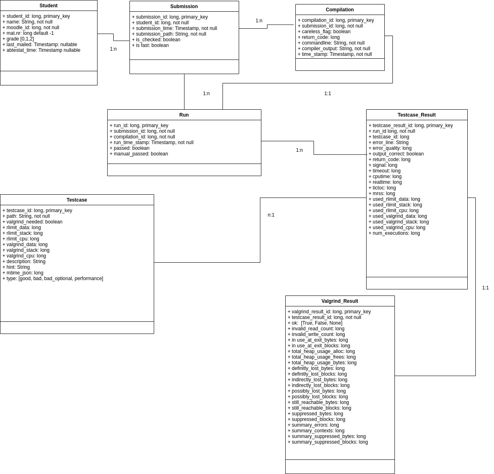

# Reworked python eval pipeline for evaluating c-programming project submissions

This python script is intended to automatically fetch submissions from a moodle page, compile these submissions for each
student and evaluate the correctness along with the performance. 
Further it is able to persist relevant information, send feedback e-mails and generate relevant grading for moodle via 
csv and also via the moodle grading api.   

## Content
1. [Usage](#usage)
    1. [Installation and Setup](#installation-and-setup)
2. [Current State of the Rework](#current-state-of-the-rework)
    1. [Stable Commandline Arguments](#stable-commandline-arguments) 
    2. [Implemented Structure](#implemented-structure) 
    3. [Implemented Features](#implemented-features)
3. [Future Development](#future-development)
    1. [Planned Structure](#planned-structure)
    2. [Planned Features](#planned-structure)
    3. [Planned Integration](#planned-integration)

## Usage
Thanks to `__init__.py` and `__main__.py`
it can be called by executing:

`python3 /path/to/eval_pipeline/`
or
`/path/to/eval_pipeline/__main__.py`

Relevant switches and flags are listed in Section [Commandline arguments](#stable-commandline-arguments)

### Installation and Setup


There needs to be a resource directory inside the `eval_pipline directory`
which contains:

  - `config_database_integrator.config`
  - `config_database_manager.config`
  - `config_submission_fetcher.config`
  - `config_test_case_executor.config`
  - `config_performance_evaluator.config`

These files are used to set relevant constants.
There are example `.config` files included in the `resource.templates` directory that need to be adjusted appropriately.

For convenience, put a symbolic link in `/usr/bin`:
```
sudo ln -s /path/to/eval_pipeline/__main__.py /usr/bin/check
```

If you want to use the automatic email functionality you might want to define a `mail_templates` directory,
where you define all relevant error messages that can be part of an email to a student.
It's worth to note, that these template massages can contain placeholder tokens,
which can be replaced during runtime. These tokens should be follow the format `$placeholder_token$`.  
 

## Current State of the Rework
This section describes the current state of the eval pipeline. 
We start with the currently usable switches and their behavior, [here](#stable-commandline-arguments). 
Followed by a description of the [current structure](#implemented-structure) and finish with a short summary of 
the [current features](#implemented-features).   

### Stable Commandline Arguments:

    -f/--fetch:     Fetches all submissions and students from moodle and stores them 
                    in a submission dir and in the provided database.
    
    --fetch-only:   Fetches all submissions and students from moodle and stores them 
                    in a submission dir and in the provided database. 
                    No test are executed afterwards. 
    
    -c/--check ["name1", "name2",...]:     
                    Runs evaluation for all students given in the list of strings. 
    
    -a/--all:       Runs evaluation for all students. By default only if not already run.
    
    -u/--unpassed-students:
                    Runs evaluation only for students, that havn't passed. 
                    Only efficient in combination with -r/--rerun.
    
    -r/--rerun:     Reruns functionallity e.g. rerun tests, remail students.
                    By default the functionality only runs if not done previously. 
    
    -v/--verbose:   Prints detailed information for all used functionallity.
    
    -d/--details ["name1","name2",...]:
                    Prints detailed information for submissions for the specified students.
                    If more than one submission is found the user is asked.      
    
    -s/--stats:     Prints stats for all students.
    
    -g/--generate:  Generates needed CSV files with the grade and passed information.  
    
    -m/--mail-to-all: 
                    Sends a feedback mail to every student who hasn't revieved a feedback mail yet.
                                  
    -A/--Abtestat ["name1",...]: 
                    Marks a student or a list of students as "abtestat done" if the student hasn't passed 
                    all test the user will be asked.
    
    -R/--Revert ["name1",...]:
                    Reverts marking a student or a list of students as "abtestat done". 
                    The user will also be ask whether to unset passed test cases.

    -D/--mark_manual ["name1",...]:
                    Marks a submission and a student as passed if corrected manually.

### Implemented Structure:

### Implemented Features:  
  - Fetching submissions from moodle or a local dir 
  - Persist student data and submission information in a sqlite database 
  - Run a specific set of Testcases, consisting of input and output, for all submissions 
  - Evaluate the results with regards to correctness and runtime  
  - Marking students as passed, and also mark whether they passed an "abtestat"
  - Send evaluation feedback to the students after running tests
  - evaluate performance (time and space) to evaluate possible competitions
  - dump relevant grading lists via csv and Moodle Grader API
  
  

## Future Development
In this section we'll describe planned future reworks and structural improvements for future work.

### Planned Structure
The planned structure is shown below in the diagram:



We advice to combine the adaptation of the presented structure while also integrating a 3rd party orm like SqlAlchemy 

### Planned Features
- automated grading on moodle when ever a mail is send
- allow optional correct output when executing malicious test cases, that aren't formally wrong  
- execute single testcases for submissions 
- separate operations with flags all, few, one for student and/or submissions

### Planned Integration 

- integrate 3rd party orm like SqlAlchemy
- integrate the [planned structure](#planned-stucture) 
  


