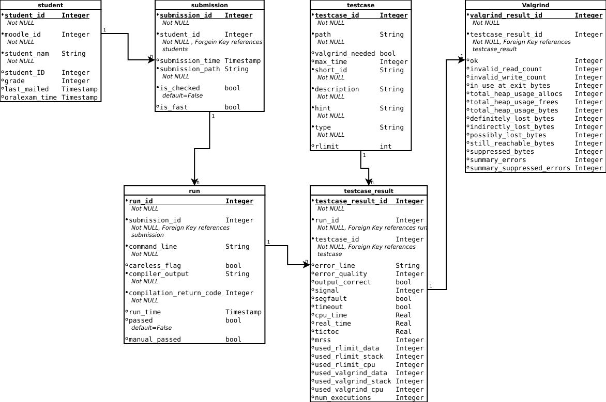

# Pipeline for checking student programming exercises

This tool was written by members of the chair of technical computer science at HU Berlin to facilitate the checking of programming exercises handed in by students via Moodle.

It automatically fetches submissions from a moodle page, compiles these submissions for each
student and evaluates the correctness along with the performance. 
Further it is able to persist relevant information, send feedback e-mails via Moodle.
It can generate relevant grading for Moodle via csv and also via the moodle grading api. 

Contributors are: Daniel Cagara, Holger Döbler, Mark Spitzner and Leonie Reichert.

## Content
1. [Option 1: Testsetup with docker](#installation-with-docker)
2. [Option 2: Installation without docker](#installation)
3. [Usage](#usage)
4. [Current State of the Eval Pipeline](#current-state-of-the-eval-pipeline)


## 1. Option 1: Setting up a testing environment with docker

This section explains how to create a setup consisting only of Docker containers which talk with one another.

* There is one container running the pipeline for testing student code.
* Another container is used to compile student code with the gcc compiler of the reference system to ensure they do not generate any warnings.
* Two containers are required to create a local Moodle setup. If you have access to a Moodle server where you can create courses, then those two  containers are not necessary. 

### Step 1: Setup the Testing Pipeline

* Execute ./build.sh : This builds the reference-clone and the pipeline
* Execute ./run.sh : This creats/starts both containers with the relevant options
* Use `sudo docker exec -it pipeline /bin/bash` to start a shell on the pipeline container

Both containers access a newly created `/tmp/dockershared` folder to exchange files.
For degubbing, it is possible to simply edit the code in `student-code-testing-pipeline/eval-pipeline` as this is folder is shared between the host OS and the pipeline container.

### Step 2: Setup a local moodle instance 

* To create a local Moodle instance which already contains students, a course and submissions, use the local `moodle/docker-compose.yml` file. To create the containers, run: 

    `cd moodle`
    `sudo docker-compose up -d`


* Another option is to use a blank Moodle setup. Moodle will not have any couses installed, so those would have to be created manually. After installing docker-compose, run:

    `curl -sSL https://raw.githubusercontent.com/bitnami/bitnami-docker-moodle/master/docker-compose.yml > docker-compose.yml`
    `sudo docker-compose up -d` 

Moodle now runs on localhost on port 80.
Login information for Moodle is username `user` with pasword `bitnami` (or check the corresponding `docker-compose.yml` file.
    
## 2. Option 2: Installation directly on a server 
This is an explenation of how to install the pipeline directly on a server without running all components in dockers. 
But docker is still necessary to emulate the gcc compiler of the reference system which is available for the students for testing. This can also be changed by editing the code.
To follow this installation it is assumed that a functioning Moodle server already exists. 

### 2.0 Preparing VM
Tested on an Ubuntu 18.04
    * Ensure sudo does not require a password (required to run docker and unshare)
    * Create additional user with name 'cpr'
    * Ensure unshare is installed (if path is not `/usr/bin/unshare` it needs to be changed in config files)
    * Compile htime in folder `c_util`. Move executable htime to `/user/bin/htime`.

### 2.1 Packages
Install Docker and Valgrind:

  - `sudo apt install docker.io`
  - `sudo apt install valgrind`

Ensure that python3.8 is installed if not use the following command (works on Ubuntu 18.04):

`$ sudo apt-get install python3.8 python3.8-dev python3.8-distutils python3.8-venv`

Install required packet bs4 for python3.8 by using:

  - `python3.8 -m pip install bs4`
  - `python3.8 -m pip install sqlalchemy`


### 2.2 Docker

Build Docker File:
  - `./dockerfiles/build.sh`

### 2.3 Resources, Config Files and Templates

There needs to be a resource directory inside the `eval_pipeline directory`
which contains:

  - `config_database_integrator.config`
  - `config_database_manager.config`
  - `config_submission_fetcher.config`
  - `config_testcase_executor.config`
  - `config_performance_evaluator.config`

These files are used to set relevant constants.
There are example `.config` files included in the `resource.templates` directory that need to be adjusted appropriately.

If you want to use the automatic email functionality you might want to define a `mail_templates` directory,
where you define all relevant error messages that can be part of an email to a student.
THE DEFAULT TEXT PIECES SHOULD BE ADAPTED before sending out feedback to students.

It's worth to note, that these template massages can contain placeholder tokens,
which can be replaced during runtime. These tokens should be follow the format `$placeholder_token$`. 


### 2.4 Moodel Course
Set up a Moodel Course with an excercise where students can submit a `.c` file. 
Set the maximal possible grade for this excersie to 2:
The grading for the C project is as follows:

   - 0 = not passed
   - 1 = submission passed
   - 2 = submission and oral exam passed

Retrieve the course ID, submission ID and ID of the account that sould be used by the pipeline for logging  into Moodle.
This can be done by opening the respective page in the web browser an copying the Id from the url. 
With these values update the entries in `C Programmierprojekt/eval_pipeline_rework/resources` the file named `config_submission_fetcher.config`. For testing purposes, the settings for an example course can be found in `resources-example/`. To use it, rename the folder to `resources/`.
As account for logging into Moodle and having multiple people receive responses from students, the following mailing list was created: "informatik.cprogrammierprojekt@lists.hu-berlin.de". The account used by the eval-pipeline should/can use this email for logging in. 
Changes to the mailinglist can be made via  `https://sympa.cms.hu-berlin.de/sympa/info/informatik.cprogrammierprojekt`. This might be necessary in case a new person in responsible for the pipeline.

### 2.5 Shortcut
For convenience, put a symbolic link in `/usr/bin` so that the pipeline can be called by simply running `check [args]` in the terminal:
```
sudo ln -s /path/to/eval_pipeline/__main__.py /usr/bin/check
```


## 3 Usage
Thanks to `__init__.py` and `__main__.py`
it can be called by executing:

`/path/to/eval_pipeline/__main__.py [args]`

(For some reason this does not work when you are already in the directory `eval_pipeline`)
Relevant switches and flags accessible with `check -h`

For convenience it is possible to create an alias or symbolic link(see [Installation]).
It can then be called by:

`check [args]`

### 3.1 Usefull Commands

During the semester:

* `check -f` : Fetches all (new) submission but does not execute them
* `check -fa`: Fetches new submissions and checks them for correctness (will not notify student)

* `check -favm` : Fetches new submissions, checks them and automatically sends mail to all students that have not yet received a mail for their last submission (semi-automatic, requires user interaction). Option "v" gives verbose Output.
* `check -rUM "Firstname Lastname"`: Send mail to named student and review mail before sending.

* `check -c "Firstname Lastname"` : Will run a specific submission (which is selectable) for a specific student. If student name does not match completly, a student will be suggested.
* `check -t "Firstname Lastname"` : Run a single (selectable) testcase for the named student.
* `check -tOV "Firstname Lastname"` : Run single testcase for student but also print output and Valgrind result. 
* `check -d "Firstname Lastname"`: Get information about the last submissions of a single student.
* `check -D "Firstname Lastname"` : Manually mark a submission as correct. Student will be automatically marked as passed. The database records manual change in a corresponding flag. This can be done if there are errors with the pipeline and student code was successfully run on the reference system.

For oral exams:
* `check -db "Firstname Lastname"`: Get information about the best submissions of a single student.
* `check -s` : List for all students that have submitted a solution if they have passed. Useful when reevaluating the bar for passing.
* `check -F` : Reruns all submission while ignoring the compiler warnings (and maybe some other stuff too). 
* `check -uF` : check all unpassed students (and all their submissions) while lowering the bar for passing.
* `check -E "Firstname Lastname"` : Record a successful oral exam for this student. Marks the student as passed if not passed in the database.
* `check -R "Firstname Lastname"` : Revert the desicion on an oral exam. Allows to remove the passed status of a student.
* `check -g`: Generates .csv files of students that have passed for the Prüfungsbüro.  


### 3.2 Automation

To automate the the checking of student code, create a cronjob for the following command:
`check -favm >> ~/log_cpp 2>&1`

## 4 Current State of the Pipeline
This section describes the current state of the eval pipeline. 
We start with the currently usable switches and their behavior, [here](#stable-commandline-arguments). 
Followed by a description of the [current structure](#implemented-structure) and finish with a short summary of 
the [current features](#implemented-features).   


### 4.1 Implemented Database Structure:
The image below represents the currently implemented structure of the evaluation pipeline. 



### 4.2 Implemented Features:  
  - Fetching submissions from moodle or a local dir 
  - Persist student data and submission information in a sqlite database 
  - Run a specific set of Testcases, consisting of input and output, for all submissions 
  - Evaluate the results with regards to correctness and runtime  
  - Marking students as passed, and also mark whether they passed an oral exam
  - Send evaluation feedback to the students after running tests
  - evaluate performance (time and space) to evaluate possible competitions
  - dump relevant grading lists via csv and Moodle Grader API
  - Guessing a students name based on input
  

### 4.3 Limitations
- Return codes of tested submissions need to be larger or equal zero (see python subprocess() call)
